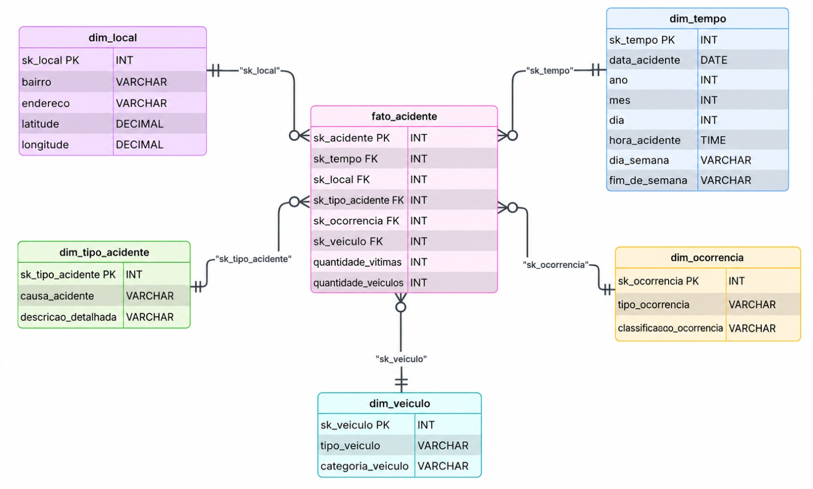

# 🚗 Pipeline de Dados: Acidentes de Trânsito com Vítimas (Recife)
**Projeto de Integração e Evolução de Sistemas Digitais - Banco de Dados - CIn/UFPE**

Este projeto implementa e compara duas arquiteturas fundamentais de Engenharia de Dados — **ETL Clássico** (Python/Pandas + SQLite) e **ELT Moderno** (DuckDB + dbt/SQL) — para processar, higienizar e modelar dados públicos sobre acidentes de trânsito.

O resultado final é a construção de uma Modelagem Dimensional (Esquema Estrela), transformando milhares de registros brutos e fragmentados em um Data Warehouse otimizado para Business Intelligence (BI) e análises históricas.

---

## 🎯 Objetivo e Desafio

O objetivo central foi integrar dados dispersos temporalmente (2014 a 2016) para permitir análises sobre a mobilidade urbana, identificando pontos críticos e perfis de acidentes na cidade.

* **Fonte:** Portal de Dados Abertos da Prefeitura do Recife.
* **Dados Brutos:** Arquivos heterogêneos em CSV e GeoJSON (anuais e mensais).
* **Desafios Principais:** Inconsistência nos nomes e quantidades de colunas entre os anos, múltiplos formatos de data, coordenadas geográficas invertidas (latitude/longitude) e dados nulos/ausentes.

---

## 🏗️ Arquitetura da Solução

O projeto constrói o mesmo modelo final através de dois caminhos distintos para fins de comparação prática:

### 1. Abordagem ETL (Python Driven)
* **Extração:** Leitura automatizada dos arquivos CSV e GeoJSON utilizando a biblioteca Pandas.
* **Transformação:** Limpeza pesada em memória (conversão de datas, padronização de textos para maiúsculo, tratamento de nulos e classificação de veículos) utilizando lógicas do Python.
* **Carga:** Inserção das tabelas finais estruturadas (Fato e Dimensões) em um banco de dados local **SQLite** utilizando a biblioteca nativa `sqlite3`.

### 2. Abordagem ELT (Modern Data Stack)
* **Extração & Carga (EL):** O Python atua apenas como orquestrador, carregando os 8 arquivos brutos diretamente para o **DuckDB** em um schema *raw* (Staging), sem tipagem prévia.
* **Transformação (T):** O **dbt** (data build tool) orquestra todas as transformações complexas no próprio banco usando SQL. Envolveu consolidação via `UNION ALL`, correções dinâmicas de eixos geográficos invertidos, CTEs com expressões regulares e geração de surrogate keys analíticas (`ROW_NUMBER()`).

---

## ⭐ Modelagem de Dados (Esquema Estrela)

Ao final do pipeline, consolidamos os três anos de dados em uma estrutura dimensional consistente, composta por uma Tabela Fato e cinco Tabelas Dimensão:

 

| Tabela | Tipo | Descrição |
| :--- | :--- | :--- |
| **fato_acidente** | Fato | Registro central do acidente. Contém chaves estrangeiras (SKs), a quantidade de vítimas e a quantidade de veículos envolvidos. |
| **dim_tempo** | Dimensão | Calendário detalhado (Ano, Mês, Dia, Hora, Dia da Semana, Flag de Fim de Semana) para análises temporais. |
| **dim_local** | Dimensão | Dados geográficos da ocorrência (Bairro, Endereço, Latitude, Longitude). |
| **dim_tipo_acidente** | Dimensão | Natureza do evento (Causa do acidente e Descrição detalhada). |
| **dim_ocorrencia** | Dimensão | Classificação administrativa (Tipo e Classificação da ocorrência). |
| **dim_veiculo** | Dimensão | Dados dos transportes envolvidos (Tipo de veículo e Categoria macro). |

---

## 🛠️ Tecnologias Utilizadas

* **Linguagens:** Python 3+ e SQL.
* **Manipulação de Dados:** Pandas.
* **Bancos de Dados:** SQLite e DuckDB (OLAP Colunar).
* **Transformação e Orquestração:** dbt (Data Build Tool).
* **Versionamento:** Git e GitHub.

---

## 📂 Estrutura do Repositório

```text
.
├── docs/
│   ├──diagrama_fluxo.png                   # Diagrama
│   ├──dicionario_dados.md 
│   ├──esquema_estrela.png                  # Esquema Estrela  
│   └──Projeto de Integração - GRUPO 9.pdf
├── insights/                               # Arquivos SQL com as análises finais
├── pipelns/                                # Pipelines de ETL e ELT
│   ├── data/                               # Dados brutos (2014, 2015, 2016)
│   ├── outputs/                            # Saídas
│   │    ├── etl/
│   │    └── elt/
│   ├──pipeline_ELT_acidentes_recife.ipynb
│   └──Pipeline_ETL_Acidentes_.ipynb
├── CONTRIBUTING.md                         # Padronização de contribuições e commits
├── INFO_DATASETS.md                        # Estrutura e metadados dos datasets
└── README.md
```
## 🚀 Como Executar

### Pré-requisitos

Instale Python na sua máquina (ou utilize o Google Colab).

Clone este repositório.

Instale as dependências executando no terminal:
```bash
pip install pandas numpy duckdb
```

Certifique-se de que os 8 arquivos de origem (CSVs e GeoJSONs de 2014 a 2016) estão devidamente alocados na pasta ./data/.

#### Passo 1: Execução do Pipeline ETL Clássico (Pandas + SQLite)

Abra e execute todas as células do notebook Pipeline_ETL_Acidentes.ipynb

#### O que acontece: 

O Pandas extrai e transforma os dados pesadamente em memória RAM. Ao final, o script DDL cria o banco relacional local dw_acidentes.db e as tabelas Fato e Dimensões são populadas utilizando .to_sql().

#### Passo 2: Execução do Pipeline ELT Moderno (DuckDB + SQL)


Baixe o arquivo pipeline_ELT_acidentes_recife.ipynb e abra-o pelo Google Colab, em seguida 
certifique-se de que os 8 arquivos de origem (CSVs e GeoJSONs de 2014 a 2016) da pasta./data/. estão devidamente alocados no colab. Por último execute todas as células do notebook.

#### O que acontece: 

O script faz a carga bruta (Load) dos arquivos exatamente como vieram para um schema raw no banco analítico acidentes_dw.duckdb. Em seguida, roda os blocos de Transformação (SQL puro com CTEs) para gerar as Surrogate Keys e montar o Esquema Estrela dentro do schema dw.

#### Passo 3: Validação e Insights (Testes de Qualidade)

Exportação dos Resultados: As bases modeladas serão exportadas como .csv para as pastas de outputs/etl/ e outputs/elt/.

Queries Analíticas: Serão gerados DataFrames de visualização rápida demonstrando insights (ex: cruzamento de acidentes por bairro, tipo de veículo e envolvimento no fim de semana).
